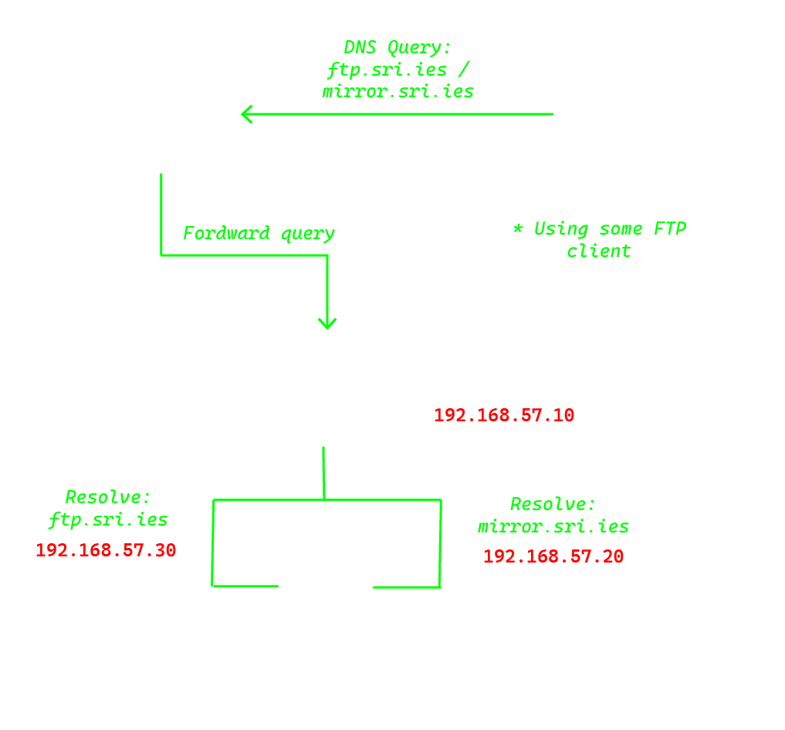

# FTP Server and DNS Configuration using Vagrant + Ansible

<div align="center">
    
</div>

This project configures a secure and functional FTP server using vsftpd on Linux. The server supports anonymous and local users, with support for SSL/TLS encryption and `chroot` options for specific users.

## Features

- **Local users**: Authenticate using system-local credentials.
- **Chroot support**: Restrict specific users to their home directories while allowing others unrestricted access.
- **SSL/TLS encryption**: Ensures secure FTP sessions.
- **Anonymous users**: Separate configuration for anonymous FTP access (if enabled).
- **Automation**: Configuration managed via Ansible for seamless deployment.

## Requirements

- Unix-based system
- Ansible for automated setup
- Vagrant 2.4.3 or latest
- FTP Client like `Filezilla` or `lftp`

## Documentation

To see documentation of the project you can [click here](https://github.com/sporestudio/ftp-server/blob/main/docs/README.md) or see the docs/ directory.

## Installation

> [!NOTE]
> This installation instructions are provided for Unix systems only

#### 1. Clone the repository

Clone the repository from GitHub:

```bash
$ git clone https://github.com/sporestudio/ftp-server
$ cd ftp-server
```

#### 2. Deploy the project

Use `Vagrant` to deploy the project:

```bash
$ vagrant up
```

#### 3. Testing

To check that it's working properly you can run the tests.

##### DNS test

Run the test to check if the dns server can resolve the addresses.

```bash
$ chmod +x tests/dns-test.sh
$ tests/dns-test.sh 192.168.57.10
```

##### FTP test

Run the test in Python for the FTP server.

```bash
$ python3 tests/test-ftp.py
```

## Contributions

Want to contribute? There are multiple ways you can contribute to this project. Here are some ideas:

* [Translate the web into multiple languages!](/docs/CONTRIBUTING.md#translations)
* [Reporting Bugs](/docs/CONTRIBUTING.md#reporting-bugs) 
* [Check out some issues](https://github.com/sporestudio/ftp-server/issues) (or translate them).

## License

This project is under [GNU General Public License](./LICENSE)

## Authors

This project was created by [Jorge Rodriguez](https://github.com/sporestudio), [Juan Diego](https://github.com/JuanDiego1406), [Miguel Angel](https://github.com/leogamer644).
